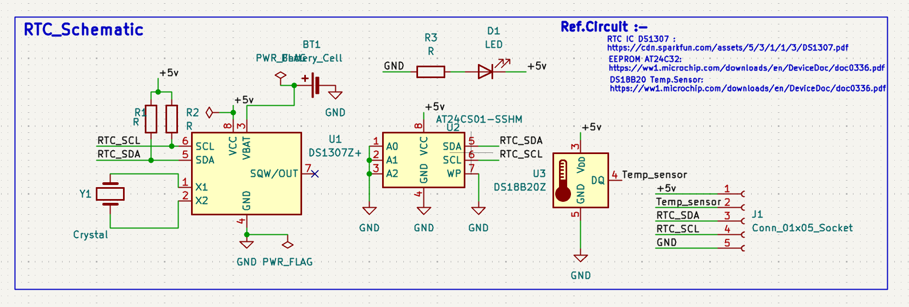
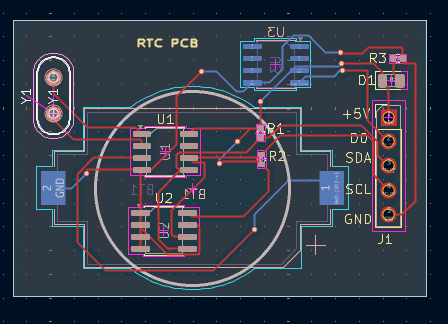

# RTC-DESIGN-PCB
# RTC Design PCB

## 📌 Overview

This project is a Real-Time Clock (RTC) PCB designed using KiCad. It provides accurate date and time keeping for embedded systems.

## ✨ Features

- Real-Time Clock Circuit
- 2-Layer PCB Design
- Compact PCB Layout
- ERC and DRC Checked
- Manufacturing Ready Gerber Files

## 🛠 Software Used

- KiCad 10.0

## 📂 Project Files

- KiCad Project (.kicad_pro)
- Schematic (.kicad_sch)
- PCB Layout (.kicad_pcb)
- Gerber Files
- Project Images

## 📷 Project Images

### Schematic

### PCB Layout

### Top 3D View

### Bottom 3D View

## 📦 Gerber Files

All manufacturing Gerber files are available in the **Gerber** folder.

## 👨‍💻 Author

**Yogesh Kumar**
